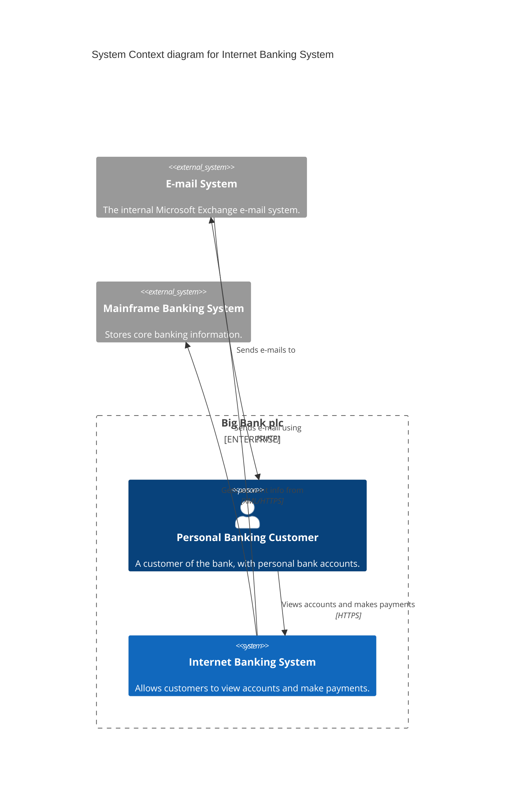
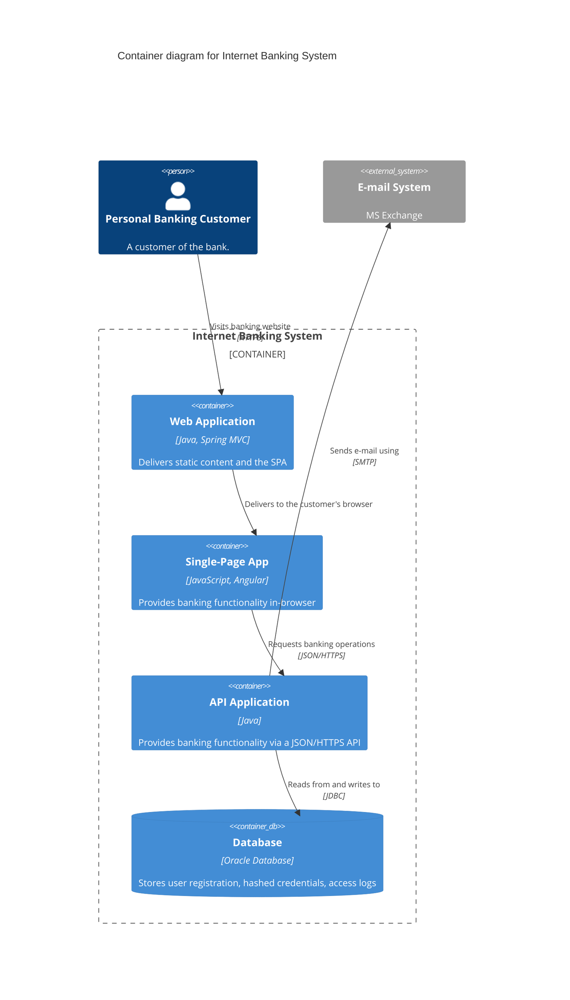
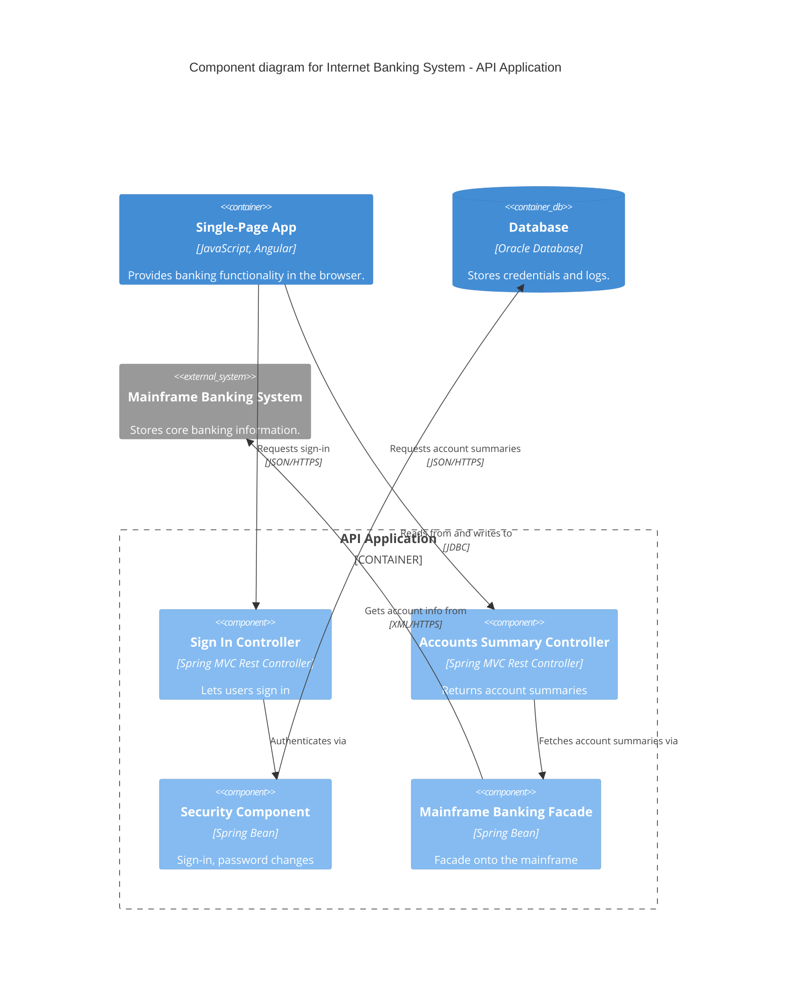
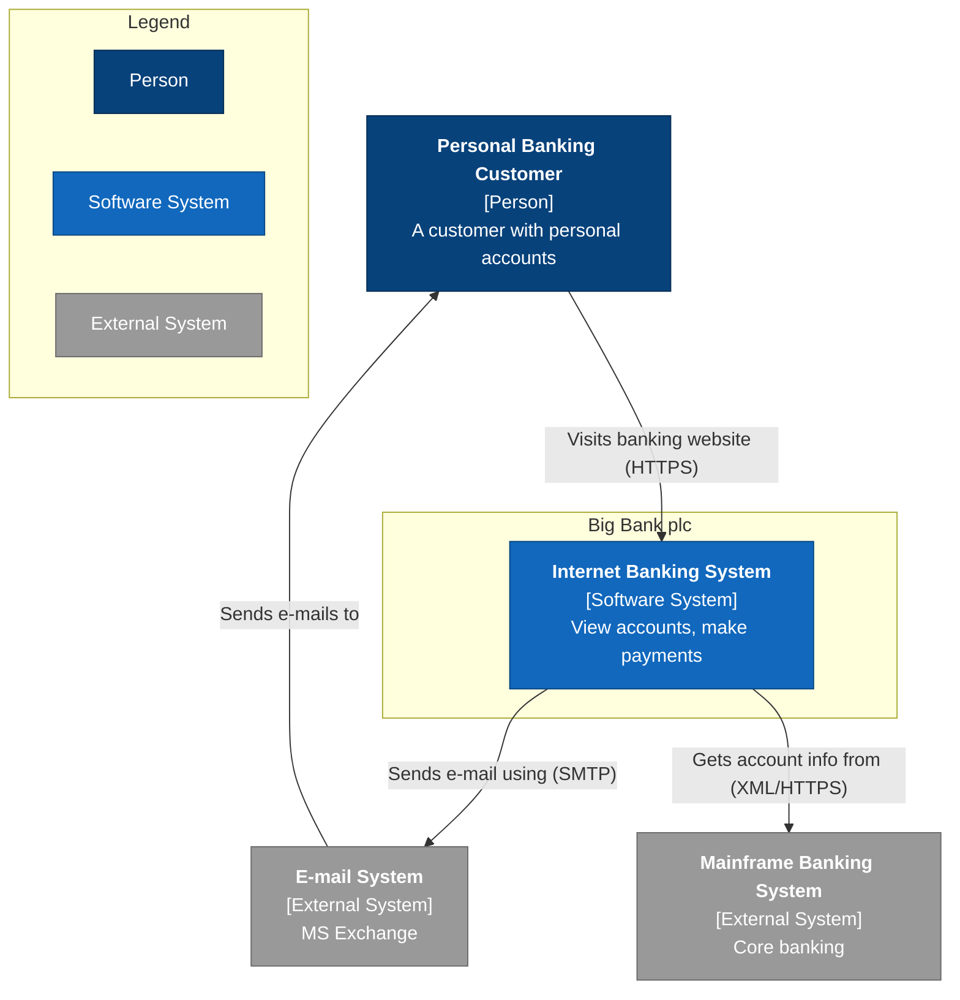
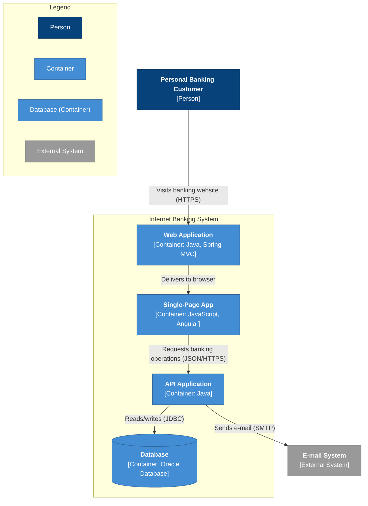
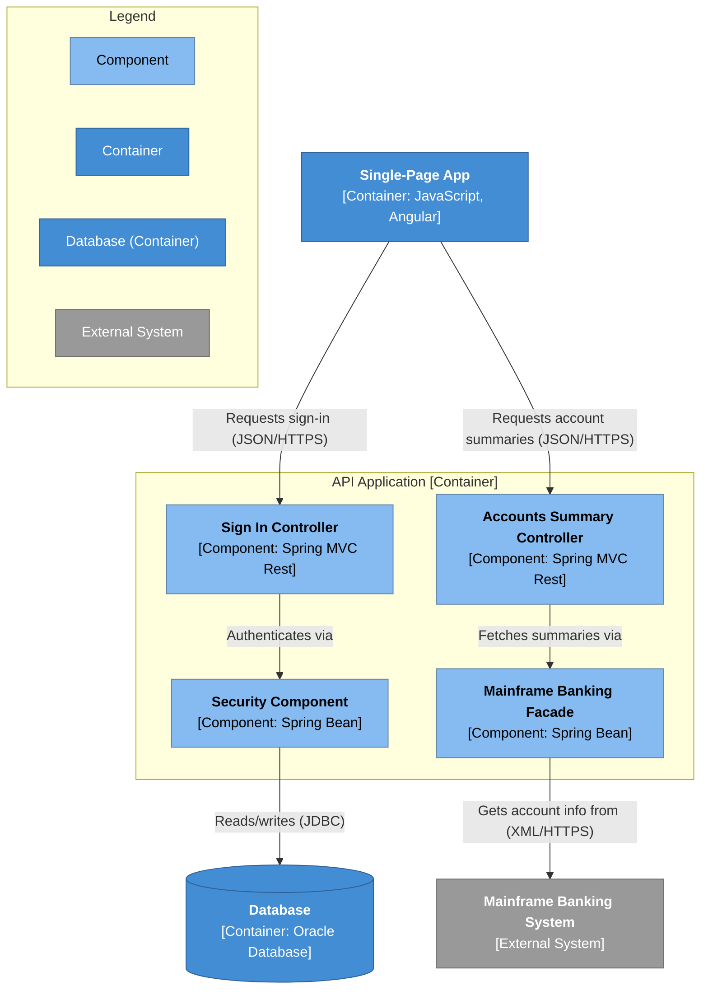

# C4 Notation Reference

On-demand cheat sheet for the four text-based C4 notations. Copy-paste the templates
into your renderer of choice; tune from there.

For the C4 method itself (levels, element taxonomy, review checklist) see `c4-method.md`.

---

## Table of Contents

1. [Selection matrix](#1-selection-matrix)
2. [Mermaid native C4](#2-mermaid-native-c4)
   - L1 System Context
   - L2 Container
   - L3 Component
3. [Mermaid flowchart-as-C4](#3-mermaid-flowchart-as-c4)
   - L1 System Context
   - L2 Container
   - L3 Component
4. [Structurizr DSL](#4-structurizr-dsl)
   - Combined L1 / L2 / L3 workspace
5. [C4-PlantUML](#5-c4-plantuml)
   - L1 System Context
   - L2 Container
   - L3 Component
6. [Version pinning note](#6-version-pinning-note)

---

## 1. Selection matrix

| Notation | Choose this when… | Renderer | Maturity |
|---|---|---|---|
| **Mermaid native C4** (`C4Context` / `C4Container` / `C4Component`) | You want a zero-toolchain diagram that renders inline in GitHub / GitLab / Markdown / docs sites with no extra software. | Mermaid (built into GitHub, many tools); JS lib `mermaid` | **Experimental** — syntax may change; weak auto-layout; no legend. |
| **Mermaid flowchart-as-C4** (`flowchart` + `subgraph` + `classDef`) | You want full styling and layout control plus Mermaid portability, and native C4's experimental layout is insufficient. | Same as Mermaid native — no external binary. | Stable Mermaid core; **not real C4** — element semantics are hand-rolled via class + text. |
| **Structurizr DSL** (`workspace { model { … } views { … } }`) | You have a large or evolving system and want to **model once → generate many consistent views** (single source of truth). | Needs a Structurizr renderer: Structurizr Lite (free, Docker), cloud service, or on-premises. Not GitHub-native. | Mature; **auto-generated view keys are unstable** — always set explicit keys. |
| **C4-PlantUML** (`!include C4_Context.puml`, macros `Person` / `System` / `Container` / `Rel`) | You already run a **PlantUML toolchain** (CI, IntelliJ, VS Code, Confluence plugins) and want first-class C4 macros inside it. | PlantUML + Graphviz (Graphviz required for layout). | Mature community standard; **v2.12.0 layout change** for `Lay_*` / `LAYOUT_LANDSCAPE`. |

---

## 2. Mermaid native C4

**Source:** https://mermaid.js.org/syntax/c4.html
(raw docs: https://raw.githubusercontent.com/mermaid-js/mermaid/develop/docs/syntax/c4.md)

**Diagram type keywords (first line of the block):**
`C4Context` (L1) · `C4Container` (L2) · `C4Component` (L3) · `C4Dynamic` · `C4Deployment`

### Key caveat

> "C4 Diagram: This is an experimental diagram for now. The syntax and properties can change in future releases."
> — Mermaid official docs (confirmed mid-2026)

- **No smart auto-layout.** Statement order affects positioning. Tune with
  `UpdateLayoutConfig($c4ShapeInRow=…, $c4BoundaryInRow=…)` and per-relationship
  `$offsetX` / `$offsetY` on `UpdateRelStyle`.
- For production-grade layout, prefer Structurizr or C4-PlantUML.
- Renders inline in GitHub README and most Markdown hosts — no extra binary needed.

### Quick element reference

| Category | Keywords |
|---|---|
| People | `Person(alias,"label","descr")` · `Person_Ext(…)` |
| Systems | `System` · `System_Ext` · `SystemDb` · `SystemDb_Ext` · `SystemQueue` · `SystemQueue_Ext` |
| Containers | `Container` · `Container_Ext` · `ContainerDb` · `ContainerDb_Ext` · `ContainerQueue` · `ContainerQueue_Ext` |
| Components | `Component` · `Component_Ext` · `ComponentDb` · `ComponentDb_Ext` · `ComponentQueue` · `ComponentQueue_Ext` |
| Boundaries | `Enterprise_Boundary(alias,"label")` · `System_Boundary(alias,"label")` · `Container_Boundary(alias,"label")` · generic `Boundary(alias,"label","type")` — open with `{` … `}` |
| Relationships | `Rel(from,to,"label","tech")` · directional `Rel_U/D/L/R` (also `Rel_Up/Down/Left/Right`) · `Rel_Back(from,to,"label")` (draws arrow to→from, i.e. reverses direction) · `BiRel(a,b,"label")` |
| Styling | `UpdateElementStyle(alias,$fontColor=…,$bgColor=…,$borderColor=…)` · `UpdateRelStyle(from,to,$textColor=…,$lineColor=…,$offsetX=…,$offsetY=…)` · `UpdateLayoutConfig($c4ShapeInRow=…,$c4BoundaryInRow=…)` |

### L1 — System Context



### L2 — Container



### L3 — Component



---

## 3. Mermaid flowchart-as-C4

**Source:** https://mermaid.js.org/syntax/flowchart.html (flowchart primitives) + common practice.

> **Synthesized pattern.** There is no single official "flowchart → C4" example. This
> template is assembled from documented `subgraph` / `classDef` / `class` / labeled-edge
> features. Render-check before shipping.

### Key caveat

This is **not true C4 semantics.** You hand-roll element type via `classDef` and node
label text — there are no C4 macro keywords and no built-in legend.

**Gotchas (from Mermaid flowchart docs):**

- A lowercase `end` as node text breaks the chart — use `End` or `END`.
- A leading `o` or `x` after `---` produces a circle/cross arrowhead instead of a node
  link; add a space or capitalize if that is not the intent.
- **Subgraph direction limitation:** if any node inside a `subgraph` has a link to a node
  outside it, the `subgraph`'s `direction` directive is ignored and the subgraph inherits
  the parent graph direction.

### Idiomatic pattern

```
Boundaries  →  subgraph blocks (one per system / container boundary)
Element type →  classDef (one class per C4 kind) + class id1,id2 className
              or inline :::className syntax on the node definition
Relationships → labeled edges:  A -->|"Submits request (HTTPS)"| B
Label text   →  use <br/> to add [type] and description lines inside the node label
Database shape → [( … )]  gives a cylinder
```

### L1 — System Context



### L2 — Container



> The `[( … )]` node shape renders as a cylinder (database look).
> Note: because `api` links to `email` outside the `ibs` subgraph, the `direction TB`
> inside the subgraph may be overridden by the parent direction — this is a known
> Mermaid subgraph-direction limitation.

### L3 — Component



---

## 4. Structurizr DSL

**Sources:**
- Language reference: https://docs.structurizr.com/dsl/language
- DSL overview: https://docs.structurizr.com/dsl · https://structurizr.com/dsl
- Structurizr Lite: https://docs.structurizr.com/lite · https://hub.docker.com/r/structurizr/lite

### Key caveat

**Auto-generated view keys are NOT stable.** From the docs: "automatically generated view
keys are not guaranteed to be stable over time, and you will likely lose manual layout
information." Always specify an explicit `key` string on every view block (as shown below).

This notation is **not rendered natively by GitHub / Markdown.** You need one of:

- **Structurizr Lite** — free, open source, single-user. Run the Docker image
  (`structurizr/lite`), point it at a folder containing `workspace.dsl`, open in a browser.
  Good for local authoring and staging.
- **Structurizr cloud service** or **on-premises installation** — adds team collaboration.
- Structurizr export tooling can convert to PlantUML / Mermaid for rendering elsewhere.

### Concept

One model block → many consistent view blocks. Define every person, system, container,
component, and relationship once; then declare as many `systemContext`, `container`, and
`component` views over that model as you need.

### Element and relationship syntax

```
person <id> "Name" ["description"]
softwareSystem <id> "Name" ["description"] ["tags"] { … }
container <id> "Name" ["description"] ["technology"] ["tags"] { … }
component <id> "Name" ["description"] ["technology"] ["tags"] { … }
<source> -> <destination> ["description"] ["technology"] ["tags"]
```

### View block syntax

```
systemContext <softwareSystemId> "<key>" {
    include *          // or list specific ids
    autoLayout [tb|bt|lr|rl]
}
container <softwareSystemId> "<key>" { … }
component <containerId>      "<key>" { … }
```

### L1 / L2 / L3 — combined workspace (one file, three views)

```
workspace "Internet Banking" "C4 model of the Internet Banking System" {

    model {
        customer = person "Personal Banking Customer" "A customer of the bank."

        bank = softwareSystem "Internet Banking System" "Lets customers view accounts and make payments." {
            web  = container "Web Application"  "Delivers static content and the SPA"       "Java, Spring MVC"
            spa  = container "Single-Page App"  "Provides banking functionality in-browser" "JavaScript, Angular"
            api  = container "API Application"  "Provides banking functionality via API"    "Java" {
                signin   = component "Sign In Controller"          "Lets users sign in"       "Spring MVC Rest Controller"
                accounts = component "Accounts Summary Controller" "Returns account summaries" "Spring MVC Rest Controller"
                security = component "Security Component"          "Sign-in, passwords"       "Spring Bean"
                facade   = component "Mainframe Banking Facade"    "Facade onto the mainframe" "Spring Bean"
            }
            database = container "Database" "Stores user registration, hashed credentials, access logs" "Oracle Database" {
                tags "Database"
            }
        }

        email     = softwareSystem "E-mail System"            "MS Exchange"  { tags "External" }
        mainframe = softwareSystem "Mainframe Banking System" "Core banking" { tags "External" }

        # relationships
        customer -> bank      "Views accounts and makes payments"
        customer -> web       "Visits banking website"       "HTTPS"
        web      -> spa       "Delivers to the customer's browser"
        spa      -> api       "Requests banking operations" "JSON/HTTPS"
        api      -> database  "Reads from and writes to" "JDBC"
        api      -> mainframe "Gets account info from" "XML/HTTPS"
        bank     -> email     "Sends e-mail using" "SMTP"
        signin   -> security  "Authenticates via"
        accounts -> facade    "Fetches account summaries via"
        security -> database  "Reads from and writes to" "JDBC"
        facade   -> mainframe "Gets account info from" "XML/HTTPS"
    }

    views {
        # L1 — System Context
        systemContext bank "SystemContext" {
            include *
            autoLayout
        }

        # L2 — Container
        container bank "Containers" {
            include *
            autoLayout
        }

        # L3 — Component (scoped to the api container)
        component api "Components" {
            include *
            autoLayout
        }

        styles {
            element "Person"   { shape Person   background #08427b color #ffffff }
            element "External" { background #999999 color #ffffff }
            element "Database" { shape Cylinder }
        }
    }
}
```

---

## 5. C4-PlantUML

**Sources:**
- Library: https://github.com/plantuml-stdlib/C4-PlantUML
- README: https://raw.githubusercontent.com/plantuml-stdlib/C4-PlantUML/master/README.md
- Samples: https://github.com/plantuml-stdlib/C4-PlantUML/blob/master/samples/C4CoreDiagrams.md

### Include lines (pick the deepest level you need; each builds on the previous)

```plantuml
!include https://raw.githubusercontent.com/plantuml-stdlib/C4-PlantUML/master/C4_Context.puml
!include https://raw.githubusercontent.com/plantuml-stdlib/C4-PlantUML/master/C4_Container.puml
!include https://raw.githubusercontent.com/plantuml-stdlib/C4-PlantUML/master/C4_Component.puml
!include https://raw.githubusercontent.com/plantuml-stdlib/C4-PlantUML/master/C4_Dynamic.puml
!include https://raw.githubusercontent.com/plantuml-stdlib/C4-PlantUML/master/C4_Deployment.puml
```

> **Offline use:** download the `.puml` files into your repo and switch to relative includes,
> then run `java -jar plantuml.jar -DRELATIVE_INCLUDE="." …`. For VS Code, set
> `plantuml.includepaths` accordingly.

### Key caveat

**Requires PlantUML + Graphviz.** PlantUML parses the macros; Graphviz `dot` performs
layout — install both.

**Version-sensitive (v2.12.0 layout change):** When `LAYOUT_LANDSCAPE()` is combined with
`Lay_*()` calls, PlantUML 2.12.0 corrected a positioning bug that previously swapped
up↔left / down↔right. If a diagram authored on an older PlantUML looks rotated after
upgrading, use `!NO_LAY_ROTATE=1` to restore the old behavior. Pin a PlantUML version in
CI for reproducible layout.

### Macro reference

| Category | Macros |
|---|---|
| People | `Person(alias,"label"[,"descr"])` · `Person_Ext(…)` |
| Systems | `System` · `System_Ext` · `SystemDb` · `SystemDb_Ext` · `SystemQueue` · `SystemQueue_Ext` |
| Containers | `Container(alias,"label","tech"[,"descr"])` · `Container_Ext` · `ContainerDb` · `ContainerDb_Ext` · `ContainerQueue` · `ContainerQueue_Ext` |
| Components | `Component(alias,"label","tech"[,"descr"])` · `Component_Ext` · `ComponentDb` · `ComponentDb_Ext` · `ComponentQueue` · `ComponentQueue_Ext` |
| Boundaries | `Enterprise_Boundary(alias,"label")` · `System_Boundary(alias,"label")` · `Container_Boundary(alias,"label")` · generic `Boundary(alias,"label"[,"type"])` |
| Relationships | `Rel(from,to,"label"[,"tech"])` · directional `Rel_U/D/L/R` (also `_Up/_Down/_Left/_Right`) · `Rel_Back` · `Rel_Neighbor` · `Rel_Back_Neighbor` · `BiRel` |
| Layout | `LAYOUT_TOP_DOWN()` · `LAYOUT_LEFT_RIGHT()` · `LAYOUT_LANDSCAPE()` · `LAYOUT_WITH_LEGEND()` · `SHOW_LEGEND()` · positional `Lay_U/D/L/R` |

### L1 — System Context

```plantuml
@startuml Internet_Banking_SystemContext
!include https://raw.githubusercontent.com/plantuml-stdlib/C4-PlantUML/master/C4_Context.puml

LAYOUT_WITH_LEGEND()
title System Context diagram for Internet Banking System

Person(customer, "Personal Banking Customer", "A customer of the bank.")
System(banking, "Internet Banking System", "Allows customers to view accounts and make payments.")
System_Ext(email, "E-mail System", "The internal Microsoft Exchange e-mail system.")
System_Ext(mainframe, "Mainframe Banking System", "Stores core banking information.")

  Rel(customer, banking, "Views accounts and makes payments", "HTTPS")
  Rel(banking, email, "Sends e-mail using", "SMTP")
  Rel(banking, mainframe, "Gets account info from", "XML/HTTPS")
  Rel_Back(customer, email, "Sends e-mails to")
@enduml
```

### L2 — Container

```plantuml
@startuml Internet_Banking_Containers
!include https://raw.githubusercontent.com/plantuml-stdlib/C4-PlantUML/master/C4_Container.puml

LAYOUT_WITH_LEGEND()
title Container diagram for Internet Banking System

Person(customer, "Personal Banking Customer", "A customer of the bank.")
System_Ext(email, "E-mail System", "MS Exchange")

System_Boundary(c1, "Internet Banking System") {
    Container(web, "Web Application",  "Java, Spring MVC",      "Delivers static content and the SPA")
    Container(spa, "Single-Page App",  "JavaScript, Angular",   "Provides banking functionality in the browser")
    Container(api, "API Application",  "Java",                  "Provides banking functionality via a JSON/HTTPS API")
    ContainerDb(db, "Database",        "Oracle Database",       "Stores user registration, hashed credentials, access logs")
}

  Rel(customer, web, "Visits banking website", "HTTPS")
  Rel(web, spa, "Delivers to the customer's browser")
  Rel(spa, api, "Requests banking operations", "JSON/HTTPS")
  Rel(api, db, "Reads from and writes to", "JDBC")
  Rel(api, email, "Sends e-mail using", "SMTP")
@enduml
```

### L3 — Component

```plantuml
@startuml Internet_Banking_Components
!include https://raw.githubusercontent.com/plantuml-stdlib/C4-PlantUML/master/C4_Component.puml

LAYOUT_WITH_LEGEND()
title Component diagram for Internet Banking System - API Application

Container(spa, "Single-Page App", "JavaScript, Angular", "Provides banking functionality in the browser")
ContainerDb(db, "Database", "Oracle Database", "Stores credentials and access logs")
System_Ext(mainframe, "Mainframe Banking System", "Core banking")

Container_Boundary(api, "API Application") {
    Component(signin,   "Sign In Controller",          "Spring MVC Rest Controller", "Lets users sign in")
    Component(accounts, "Accounts Summary Controller", "Spring MVC Rest Controller", "Returns account summaries")
    Component(security, "Security Component",          "Spring Bean",                "Sign-in, password changes")
    Component(facade,   "Mainframe Banking Facade",    "Spring Bean",                "Facade onto the mainframe")
}

  Rel(spa, signin,   "Requests sign-in", "JSON/HTTPS")
  Rel(spa, accounts, "Requests account summaries", "JSON/HTTPS")
  Rel(signin,   security, "Authenticates via")
  Rel(accounts, facade,   "Fetches account summaries via")
  Rel(security, db,        "Reads from and writes to", "JDBC")
  Rel(facade,   mainframe, "Gets account info from", "XML/HTTPS")
@enduml
```

---

## 6. Version pinning note

Layout behavior shifts between minor releases of both Mermaid and PlantUML.

- **Mermaid:** pin a known-good version in your CI pipeline rather than floating to
  `latest`. The native C4 diagram type is still experimental, so a bump may change syntax
  or output layout without a major version signal.
- **PlantUML:** pin the JAR / Docker image version. PlantUML 2.12.0 changed `Lay_*` and
  `LAYOUT_LANDSCAPE` positioning (see the C4-PlantUML caveat above). Use `!NO_LAY_ROTATE=1`
  to restore the pre-2.12.0 behavior while you migrate.
- **Structurizr Lite:** less layout-volatile, but pin the Docker image tag to avoid
  unexpected rendering changes in your authoring environment.
